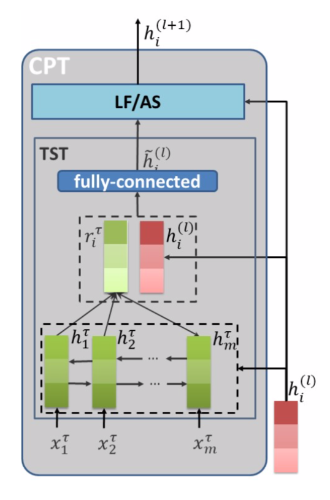

# ABSC_APWEBWAIM

This is an aspect-based sentiment analysis project. We implemented many models(LSTM, ATAE-LSTM, BILSTM-ATT-G, GCAE, Memnet, RAM, TNet). If you use this code, please cite the original paper and this project.

## Requirements
+ python 3.6
+ pytorch 1.0
+ tensorboardX
+ tqdm
+ nltk
+ absl-py

## Usage

```bash
# prepro
python -m lstm.main --mode prepro
# train
python -m lstm.main --mode train
# test
python -m lstm.main --mode test
# You can set different parameters or use different models and datasets.
```

## Experiment Results

| Models | Restaurant | Laptop | Twitter | 
| ------ | -----:| -----: | ----: |
| LSTM | 76.70/63.57 | 69.28/63.30 | 66.04/63.46 |
| ATAE-LSTM | 77.23/63.73 | 69.44/63.46 | 71.24/69.19 |
| GCAE | 78.12/62.50 | 70.38/64.02 | 72.40/70.89 |
| BILSTM-ATT-G | 79.20/67.07 | 71.32/64.88 | 71.68/70.37 |
| Memnet | 77.86/64.47 | 68.18/62.46 | 69.80/66.86 |
| RAM | 78.30/65.42 | 71.63/66.73 | 71.24/68.75 |
| TNet | 78.39/65.37 | 73.98/68.64 | 72.11/70.01 |

## Models
**ATAE-LSTM** Wang, Yequan, Minlie Huang, and Li Zhao. "Attention-based LSTM for aspect-level sentiment classification." Proceedings of the 2016 conference on empirical methods in natural language processing. 2016.

<div align=center>

</div>

**GCAE** Xue, Wei, and Tao Li. "Aspect based sentiment analysis with gated convolutional networks." arXiv preprint arXiv:1805.07043 (2018).

<div align=center>

</div>

**BILSTM-ATT-G** Liu, Jiangming, and Yue Zhang. "Attention modeling for targeted sentiment." Proceedings of the 15th Conference of the European Chapter of the Association for Computational Linguistics: Volume 2, Short Papers. 2017.

<div align=center>

</div>

**Memnet** Tang, Duyu, Bing Qin, and Ting Liu. "Aspect level sentiment classification with deep memory network." arXiv preprint arXiv:1605.08900 (2016).

<div align=center>

</div>

**RAM** Chen, Peng, et al. "Recurrent attention network on memory for aspect sentiment analysis." Proceedings of the 2017 conference on empirical methods in natural language processing. 2017.

<div align=center>

</div>

**TNet** Li, Xin, et al. "Transformation networks for target-oriented sentiment classification." arXiv preprint arXiv:1805.01086 (2018).

<div align=center>


</div>